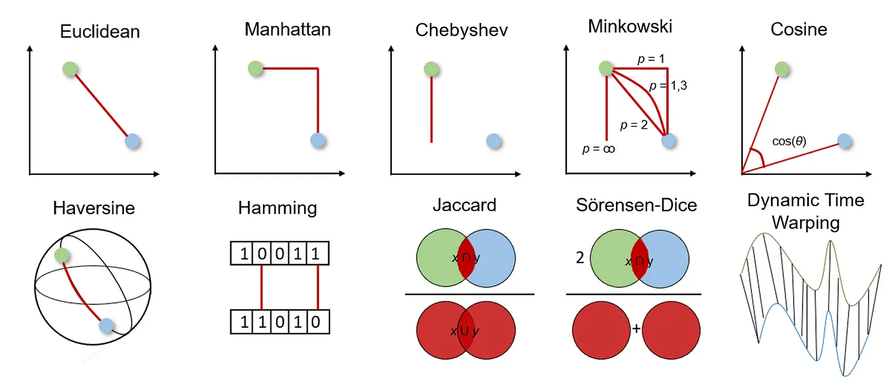
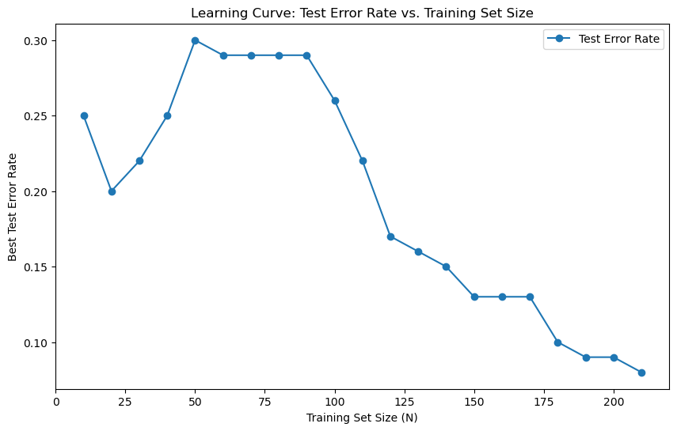
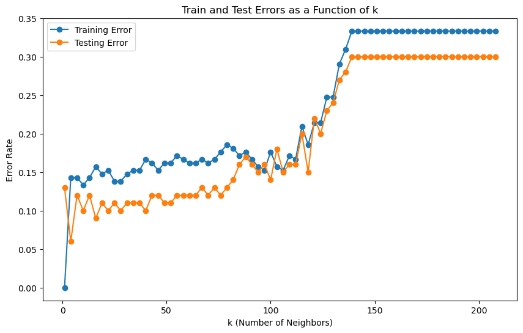

# Vertebral Column Classification with K-Nearest Neighbors (KNN)

This project uses the Vertebral Column dataset from the UCI Machine Learning Repository to classify orthopedic patients based on six biomechanical features of the pelvis and lumbar spine. The classification task focuses on distinguishing between "Normal" and "Abnormal" cases using a K-Nearest Neighbors (KNN) model. The project also explores various distance metrics and weighted voting schemes.

## Dataset Overview
The Vertebral Column dataset contains 310 instances, each represented by:
- **Pelvic Incidence**
- **Pelvic Tilt**
- **Lumbar Lordosis Angle**
- **Sacral Slope**
- **Pelvic Radius**
- **Degree of Spondylolisthesis**

The class labels include:
- **NO** (Normal)
- **AB** (Abnormal)

The dataset's primary objective is a binary classification task to predict patient condition as either Normal (NO) or Abnormal (AB).

## Project Workflow

### 1. Data Preprocessing
- **Data Loading**: Data is fetched from the UCI repository, and features are separated from target labels.
- **Class Conversion**: Class labels are mapped to binary values (Normal = 0, Abnormal = 1).
- **Data Splitting**: Data is split into training and test sets based on specified proportions to maintain balanced classes.

### 2. Exploratory Data Analysis (EDA)
- **Scatter Plots**: Pairwise scatter plots of features are created to visualize data distribution by class.
- **Box Plots**: Box plots are generated for each feature, contrasting values between Normal and Abnormal classes.

### 3. K-Nearest Neighbors (KNN) Classification
The project implements KNN using several distance metrics, including Euclidean, Manhattan, Minkowski, Chebyshev, and Mahalanobis distances. Additionally, weighted voting schemes are applied to test the influence of nearby neighbors more heavily in decision-making.

### 4. Mathematical Considerations
- **Distance Metrics**:
  - **Euclidean Distance**: Standard distance metric used as a baseline.
  - **Manhattan Distance**: A special case of Minkowski distance with \( p = 1 \).
  - **Minkowski Distance**: Generalized form where \( p \) is varied to identify the optimal distance.
  - **Chebyshev Distance**: Limiting case of Minkowski where \( p \rightarrow \infty \).
  - **Mahalanobis Distance**: Accounts for correlations between features, providing a scale-invariant metric.
  
- **Weighted Voting**: The impact of weighted KNN is explored, where neighbors closer to the test point influence the decision more than distant points. This weighting is inversely proportional to the distance.

### 5. Distance Metrics in KNN
In this project, we explore various distance metrics to understand their effect on KNN classification performance. Different metrics capture relationships between data points in unique ways, which can affect model accuracy and generalization. For example:
- **Euclidean Distance** measures straight-line distance, ideal for continuous, non-correlated features.
- **Manhattan Distance** emphasizes axis-aligned movement, suitable for grid-like data structures.
- **Chebyshev Distance** focuses on maximum coordinate differences, useful in high-dimensional spaces.
- **Cosine Similarity** measures angular distance, which can be more appropriate for high-dimensional vector data.

By testing multiple metrics, we can identify the optimal metric for this dataset, enhancing the model's ability to differentiate between "Normal" and "Abnormal" classes based on various feature relationships.



### 6. Model Evaluation
Key metrics are calculated to assess model performance:
- **Accuracy**: Percentage of correctly classified instances.
- **Precision and Recall**: Measure model correctness in classifying "Abnormal" cases.
- **F1 Score**: Harmonic mean of precision and recall, useful for imbalanced classes.
- **Confusion Matrix**: Provides insights into true positive, false positive, true negative, and false negative rates.

## Results and Insights
This project identifies the optimal distance metric, `k` value, and voting strategy for classifying the vertebral column dataset. By adjusting these hyperparameters and testing different configurations, we achieve an interpretable and robust KNN model suitable for biomedical data classification tasks.

## Learning Curves
The learning curves below illustrate model performance as training set size varies and as `k` changes:





## Getting Started

### Prerequisites
- Python 3.7+
- Libraries: `numpy`, `pandas`, `seaborn`, `matplotlib`, `scikit-learn`, `ucimlrepo`

### Installation
```bash
pip install numpy pandas seaborn matplotlib scikit-learn ucimlrepo
